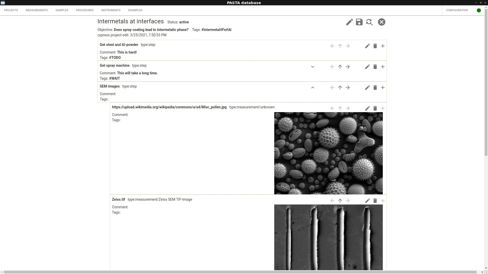
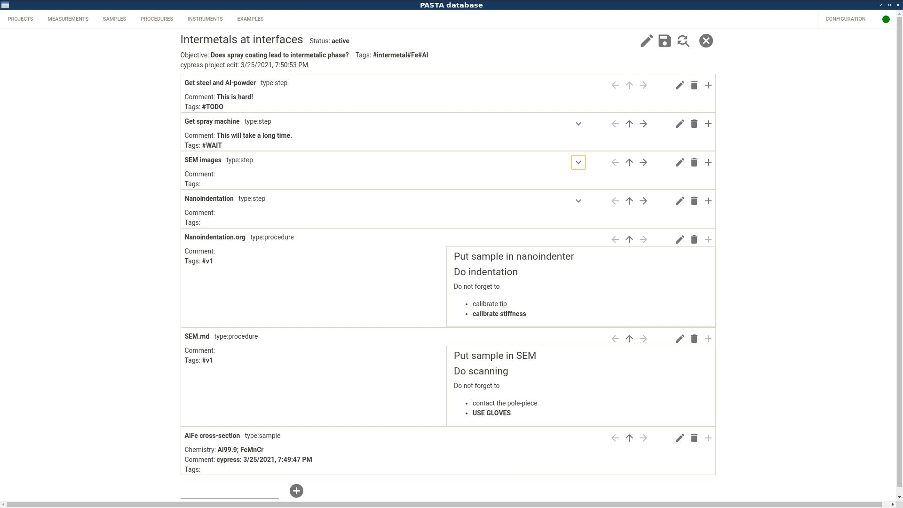
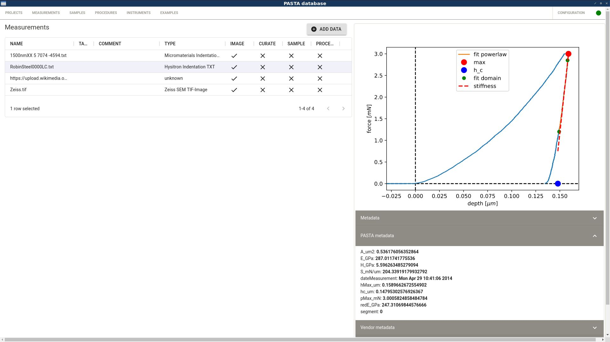
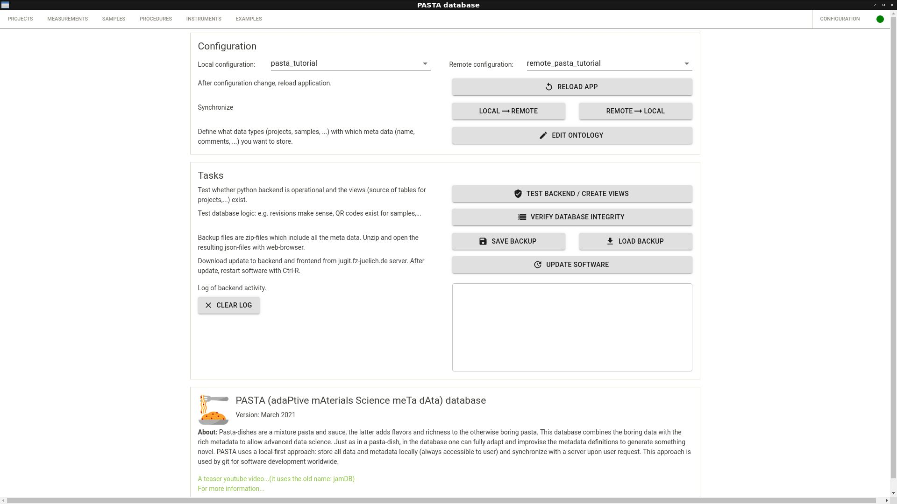

### About GUI project
React-Electron section of the PASTA database framework. The software is intended to run as native code on Linux/Windows/macOS.

There is documentation (incl. installation instructions) in the wiki-section of the MAIN-branch. [Easy link](https://jugit.fz-juelich.de/pasta/main/-/wikis/home)

### Screenshots: project
*Project hierarchy incl. steps, tasks and rendered measurements*
*Project hierarchy incl. rendered procedure and sample descriptions*

### Screenshot: measurement
*With a data-preview and extracted metadata*

### Screenshot: configuration
*With a possibility to redefine the data-structure/ontology and the ability to create/read zip-backups*

### About PASTA
Pasta-dishes are a mixture pasta and sauce, the latter adds flavors and richness to the otherwise boring pasta. This database combines the boring data with the rich metadata to allow advanced data science. Just as in a pasta-dish, in the database one can fully adapt and improvise the metadata definitions to generate something novel. PASTA uses a local-first approach: store all data and metadata locally (always accessible to user) and synchronize with a server upon user request.

